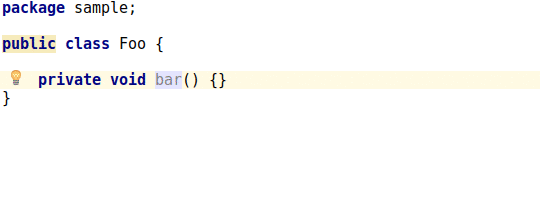
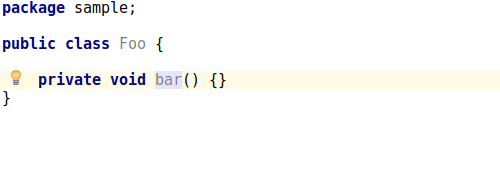
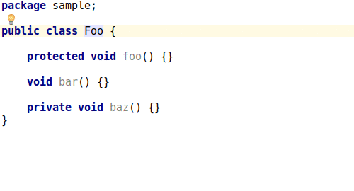
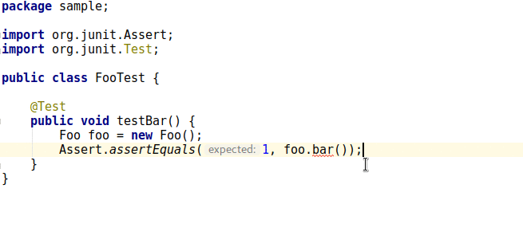

# VisibleForTesting [](https://travis-ci.org/trubitsyn/VisibleForTesting) [](https://plugins.jetbrains.com/plugin/9952-visiblefortesting)

@VisibleForTesting annotation support for the IntelliJ platform.

# Motivation

It's time-consuming to annotate existing non-public methods: you have to remove modifiers and manually type the annotation.

Now you don't have to: plugin will do that for you.

# Supported annotation types

* [android.support.annotation.VisibleForTesting](https://developer.android.com/reference/android/support/annotation/VisibleForTesting.html)
* [com.google.common.annotations.VisibleForTesting](https://google.github.io/guava/releases/19.0/api/docs/com/google/common/annotations/VisibleForTesting.html)

# Prerequisites

The desired annotation type must be accessible in order for intention actions to be shown.

## android.support.annotation

Annotation elements are available since Support Library `25.0.0` and won't be generated by the plugin when using older versions.

# Features

Supported programming languages: Java, Kotlin. Please note: Java methods cannot be annotated from Kotlin and vice-versa yet.

## Choose from multiple annotation types to import



## Annotate method (or Kotlin function in a class, object or file)

### android.support.annotation


### com.google.common.annotations



## Annotate Java or Kotlin class methods

### android.support.annotation


### com.google.common.annotations



## Annotate Java method or Kotlin function from test

### android.support.annotation


### com.google.common.annotations



# Building from source

1. Clone repository
2. Run `./gradlew buildPlugin`
3. You can find the plugin in `build/distributions` directory

# LICENSE

```
Copyright 2017, 2018 Nikola Trubitsyn

Licensed under the Apache License, Version 2.0 (the "License");
you may not use this file except in compliance with the License.
You may obtain a copy of the License at

    http://www.apache.org/licenses/LICENSE-2.0

Unless required by applicable law or agreed to in writing, software
distributed under the License is distributed on an "AS IS" BASIS,
WITHOUT WARRANTIES OR CONDITIONS OF ANY KIND, either express or implied.
See the License for the specific language governing permissions and
limitations under the License.
```
