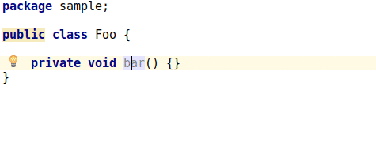
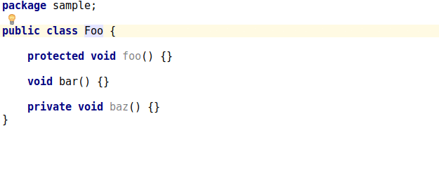
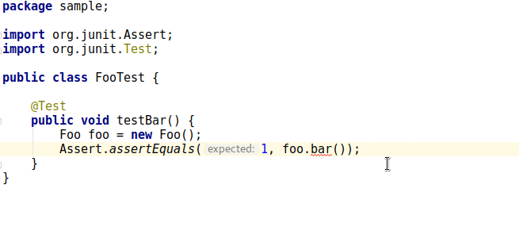

# VisibleForTesting

[@VisibleForTesting](https://developer.android.com/reference/android/support/annotation/VisibleForTesting.html) annotation support for the IntelliJ platform.

# Motivation

It's time-consuming to annotate existing non-public methods: you have to remove modifiers and manually type the annotation.

Now you don't have to: plugin will do that for you.

# Features

## Annotate method



## Annotate class methods



## Annotate from test



# Prerequisites

`android.support.annotation.VisibleForTesting` must be accessible in order for plugin to work. Intention actions won't be shown otherwise.

Follow instructions [here](https://developer.android.com/studio/write/annotations.html#adding-annotations) to add it as a dependency.

# Building from source

1. Clone repository
2. Run `./gradlew buildPlugin`
3. You can find the plugin in `build/distributions` directory

# LICENSE

```
Copyright 2017 Nikola Trubitsyn

Licensed under the Apache License, Version 2.0 (the "License");
you may not use this file except in compliance with the License.
You may obtain a copy of the License at

    http://www.apache.org/licenses/LICENSE-2.0

Unless required by applicable law or agreed to in writing, software
distributed under the License is distributed on an "AS IS" BASIS,
WITHOUT WARRANTIES OR CONDITIONS OF ANY KIND, either express or implied.
See the License for the specific language governing permissions and
limitations under the License.
```
